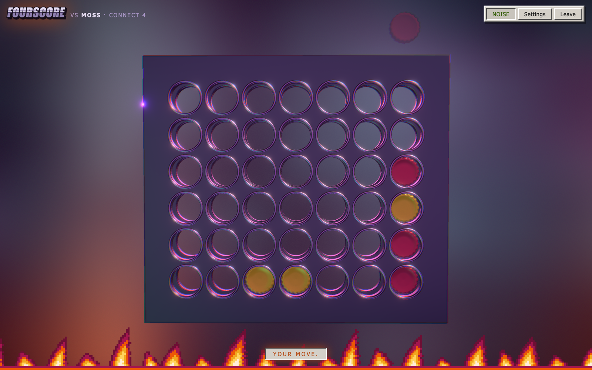

# Fourscore

Connect 4 as a hectic fever dream — a ladder of opponents who all work at the
same haunted bowling alley, for people who have run out of friends willing to
play them. Also Connect 5, 6 and 7, on progressively bigger boards, where almost
everything is harder — including for the solver.

Seven bots of increasing strength, each with a distinct way of playing rather
than just a deeper search, and then one that solves the position exactly and
does not make mistakes. After a loss it will tell you which move actually lost
it — usually about eight plies before the position looked bad.

**Play it: [fourscore-fever-beta.vercel.app](https://fourscore-fever-beta.vercel.app)**



## The four games

|  | board | to win | cells | lines per cell |
|---|---|---|---|---|
| **Connect 4** | 7x6 | 4 in a row | 42 | 1.64 |
| **Connect 5** | 9x8 | 5 in a row | 72 | 1.61 |
| **Connect 6** | 11x10 | 6 in a row | 110 | 1.59 |
| **Connect 7** | 13x12 | 7 in a row | 156 | 1.58 |

The boards grow the way they do because line density is what makes a gravity
game feel alive. Five in a row on the standard 7x6 board has 27 winning lines
over 42 cells and plays like a draw generator; each board here lands within a
few percent of Connect 4's texture instead. Odd width keeps a true centre
column, and even height matters too — the parity idea the good bots run on
(first player wants odd rows, second player even) is a theorem about
alternating play on an even number of rows, and an odd-height board would
quietly make Vane's whole personality wrong.

The engine takes any width, height and run length — `makeVariant` in `board.ts` —
so Connect N is a config change rather than a rewrite. The four above are just
the ones with art and a tuned roster. Fair warning about the biggest one: seven
in a row is hard to finish against anyone competent, and between the strong bots
most Connect 7 games fill the board. A draw there is not the game failing; it is
the game.

## Run it

```bash
npm install
npm run dev        # dev server
npm test           # unit tests (Vitest)
npm run build      # typecheck + production build
npm run typecheck  # types only
```

## The opponents

| | | |
|---|---|---|
| **Acorn** | tier 1 | Has just learned the rules. Will miss a win that is sitting there. |
| **Pebble** | tier 2 | Takes a win it can see, blocks a loss it can see, and nothing else. |
| **Moss** | tier 3 | Wants the centre columns more than it wants to win. |
| **Bramble** | tier 4 | Builds threats compulsively and cashes about half of them. |
| **Cinder** | tier 5 | Plays for positions where every reply loses. |
| **Vane** | tier 6 | Plays the quiet positional game. Its face lies about how it's going. |
| **Quill** | tier 7 | Strong opening, then solves the endgame outright. |
| **The Oracle** | — | Exact from ten discs on. Not strong play; proven play. |

On Connect 5 the ladder holds from Acorn up to Vane (measured 75-94% per rung),
but **Quill and Vane are effectively level there** — Quill wins about 56%, under
the 65% bar the project holds itself to. The reason is in
[feature_ideas.md](feature_ideas.md#dead-end-the-quill--vane-rung-on-connect-5)
along with everything that was tried: Vane's patient parity game is ideal on a taller board,
and Quill's edge — solving the endgame outright — mostly doesn't get to happen
when the crossover is at ply 44 of 72. It's written down rather than papered
over.

Each bot is a weight vector as well as a search depth, and the weights are what
you feel across the table. Bramble scores threats highly and parity at zero, so
it attacks constantly and folds when made to defend; Vane weights parity above
everything, so it plays the slow game that actually wins Connect 4 between good
players. `packages/engine/src/bots.test.ts` plays each rung against the one
below it and fails if the ladder stops being a ladder — which it caught during
development, when Moss's love of the centre made it lose to the tier beneath it.

### Tells

Bots emote from their own evaluation, not from a script. The eyes go wide when
you set up a double threat, the smirk appears when a forced win has been found,
and the shoulders drop when the position is gone. Vane is the exception: it
shows its honest face about two thirds of the time and overplays its hand the
rest, so reading it is worth something but not everything.

### The Oracle, precisely

On Connect 4 it is exact from **ten discs onward**, not from move one. That's an
honest limit, not a hedge: the opening needs a precomputed book to play
perfectly, and generating one is tens of hours of compute (the measurements and
the two ways in are in [feature_ideas.md](feature_ideas.md)). Before ten discs
it estimates like everyone else, so the opening is the only place you exist.
After it, nothing you do changes a result it has already read — and it says
"solving exactly" on screen when it crosses over.

Its first exact search of a game takes a few seconds. That one is genuine
thinking, not a spinner.

**On Connect 5 the crossover is 44 discs of 72, and most games never reach it.**
That number is measured, not chosen — `tools/measure-solve.ts live connect5`
times the bot's first exact move on real positions. A 9x8 board with five in a
row is a vastly bigger search than 7x6 with four, and a game that ends in a win
usually ends before there are only 28 empty cells left. In a five-game sample the
Oracle got to solve exactly in three of them.

On Connect 6 the crossover is 82 discs of 110, and on Connect 7 it is 127 of
156 — measured the same way, worst case across games. Out there proven play is
close to an endgame rumour: a decisive game is almost always over first.

So on the bigger boards the Oracle is mostly just a very strong estimator, and
the app says so rather than selling perfection it can't deliver: the blurb on the select
screen is generated from the crossover number, so it can't drift away from what
the solver actually does. Long, grinding games are where it turns into the thing
it is on Connect 4.

## Post-game review

Ask for the game review and you get a curve of the whole game plus every
ply scored against what was available instead, with the single move that turned
a won or drawn game into a lost one called out by name.

Underneath, the numbers come from two places. The exact solver walks backwards
from the final position — that warms the transposition table for earlier plies
and gives a natural place to stop, since positions get monotonically harder
toward the opening. Everywhere it can't reach, the heuristic evaluator says what
it thinks anyway.

That's plumbing, and the UI doesn't make you care about it: one line, one axis,
one consistent read of your game. What it does do is refuse to overclaim. An
estimated ply can never be named as the move that lost the game — that claim
requires proof. The advantage axis reserves a band at the top and bottom that
only proven results reach, so no hunch can draw itself as certain. And the copy
hedges when the number is a hunch: "looks stronger here" rather than "was the
best move available".

This is also what makes Connect 5 the more interesting board to review rather
than the worse one. About 60% of a Connect 5 game sits past the solver's horizon,
which used to mean 60% of the review was blank and now means most of it is the
engine reasoning out loud.

## Layout

- **`packages/engine`** — the whole game as pure TypeScript with zero I/O.
  - `board.ts` — bitboard and the `Variant` geometry object. A board is packed
    into `bigint` masks with a sentinel row per column, which is what lets win
    detection be a short branch-free chain instead of a scan over directions.
    One sentinel row suffices for any run length: a wrapping line has to pass
    through it on an intermediate step, and every step is in the AND chain.
  - `solver.ts` — negamax with alpha-beta, a transposition table, and a
    null-window binary search over the score range. ~1.09M nodes/sec (it was
    ~1.21M before geometry became a runtime parameter and ~1.15M before the
    transposition table's key grew lanes for Connect 6 and 7; both changes
    search a bit-for-bit identical tree, just a few percent slower).
  - `evaluate.ts` — the heuristic and the depth-limited search over it.
  - `bots.ts` — the roster.
  - `match.ts` — match state and the post-game review.
  - `tools/` — measurement scripts, run with `npx vite-node`. `measure-solve.ts`
    finds where exact play becomes affordable on a board, `ladder.ts` sweeps
    every adjacent rung to check the roster is still ordered, `bench-solve.ts`
    is raw solver throughput. The numbers in this README come from these.
- **`apps/fever`** — Vite + React + react-three-fiber. Owns rendering and the
  match runtime; no game logic. The 3D stage (`stage/`, `props/`), the Director
  that turns game truth into spectacle (`director/`), the WebAudio mangling bus
  (`audio/`), the possessed-90s DOM chrome (`chrome/`), online play (`online/`),
  and the search worker (`engine/`) — all search runs off the main thread,
  because the thinking animation is exactly the thing that must not freeze
  while the bot is thinking.

The engine is I/O-free and framework-free on purpose. That's the part that makes
authoritative online play possible later: a server can import exactly the same
module the client does, so optimistic prediction and server truth can't drift.
React is there for the screens around the game, not for the game.

## Rendering rules

The look is governed by `redesign/VISION.md` — four pillars, and a taste law
with two budgets: props are cheap by law (≤300 audited triangles, 64px
nearest-filtered textures, flat shading, stepped 12fps timing), while the void,
the board and the post stack are expensive by law (full resolution, smooth,
genuinely beautiful). The collision of the two in one frame is the aesthetic.
`apps/fever/preview.html` renders every named scene state against the dev
server and `npm run shots` screenshots them, because this is the one class of
bug a unit test cannot see. The shared outline ink (`#402e3a`) survives from
the pixel-art era, same as cozy_sprites.
